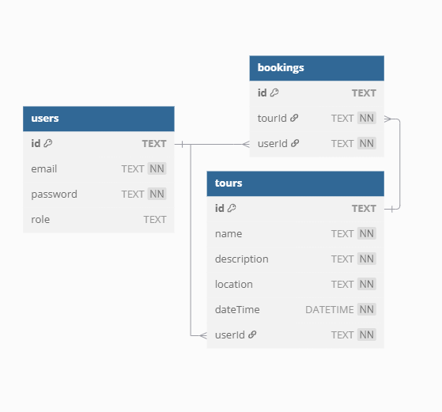

# BookaTour – REST API for Booking and Managing Tours

## Tooling

- Language: **Go 1.24**
- Framework: **Gin**
- Database: **SQLite**

---

## API Routes

### Auth

| Method | Endpoint     | Description                        |
|--------|--------------|------------------------------------|
| POST   | `/signup`    | Register a new user                |
| POST   | `/login`     | Authenticate and receive a JWT     |

---

### Tours

| Method | Endpoint               | Auth Required | Description                        |
|--------|------------------------|---------------|------------------------------------|
| GET    | `/tours/`              | ❌ No         | List all tours                     |
| GET    | `/tours/:id`           | ❌ No         | Get tour by ID                     |
| POST   | `/tours/`              | ✅ Yes        | Create a new tour                  |
| PUT    | `/tours/:id`           | ✅ Yes        | Update a tour                      |
| DELETE | `/tours/:id`           | ✅ Yes        | Delete a tour                      |
| POST   | `/tours/:id/book`      | ✅ Yes        | Book the authenticated user        |
| DELETE | `/tours/:id/cancel`    | ✅ Yes        | Cancel the user's booking          |

---

### Bookings

| Method | Endpoint                | Auth Required | Description                               |
|--------|-------------------------|---------------|-------------------------------------------|
| GET    | `/bookings/`            | ✅ Yes        | List all bookings (admin/staff only)      |
| GET    | `/bookings/user`        | ✅ Yes        | List bookings for the authenticated user  |
| GET    | `/bookings/tour/:id`    | ✅ Yes        | List bookings for a specific tour         |

---

## Run Locally

### 1. Clone the Repository

```bash
git clone https://github.com/your-username/bookatour-api.git
cd bookatour-api
```

### 2. Create a .env file with the variable:

JWT_KEY=your-secret-key

### 3. Run the server

```bash
go run main.go
```

API available at:
http://localhost:8080/api


#### Authenticated routes require a token in the Authorization header:
Authorization: Bearer <your-jwt-token>


## DB Tables

